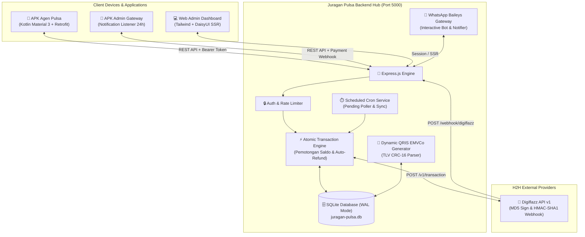

<div align="center">

  

  # ⚡ Juragan Pulsa — Server Pulsa H2H & Hub PPOB Modern

  **Platform Server Pulsa H2H (Host-to-Host) Mandiri Multi-Provider, Web Admin Fintech Dashboard, WhatsApp Baileys Gateway, dan Universal Dual-Role Native Android APK (Portal Agen & Portal Admin).**

  [](https://github.com/alijayanet/serverpulsa-h2h)
  [](https://wa.me/6281947215703)
  [](https://nodejs.org)
  [](https://kotlinlang.org)
  [](https://sqlite.org)
  [](LICENSE)

  <p align="center">
    <a href="#-fitur-unggulan">Fitur Unggulan</a> •
    <a href="#-tampilan-antarmuka-showcase">Showcase UI</a> •
    <a href="#-arsitektur-sistem">Arsitektur</a> •
    <a href="#-panduan-instalasi--deployment">Instalasi</a> •
    <a href="#-dokumentasi-api">Dokumentasi API</a> •
    <a href="#-pengembang--kontak">Kontak Pengembang</a>
  </p>

</div>

---

## 👨‍💻 Pengembang & Kontak Resmi

Aplikasi ini dikembangkan dan dikelola secara profesional oleh:

| Informasi Pengembang | Detail Kontak |
|:---|:---|
| **Nama Pengembang / Vendor** | **ALIJAYA NET** |
| **WhatsApp / Telepon** | [**081947215703**](https://wa.me/6281947215703) *(Chat Langsung)* |
| **Repository Resmi** | [github.com/alijayanet/serverpulsa-h2h](https://github.com/alijayanet/serverpulsa-h2h) |
| **Layanan** | Setup Server Pulsa H2H, Custom APK Branding Konter, Integrasi API Payment & Provider, Konsultasi Server Mandiri |

---

## 🌟 Fitur Unggulan

### 1. 🚀 Backend H2H Engine & Database Super Cepat
- **Multi-Provider H2H Hub**: Adapter resmi **Digiflazz API v1** (Prepaid & Pascabayar) dengan arsitektur modular yang siap ditambah provider lain.
- **High-Performance SQLite WAL**: Dilengkapi *Write-Ahead Logging*, cache 64 MB, memory-mapped I/O 128 MB, dan performa konkurensi tinggi tanpa beban database eksternal yang rumit.
- **Transaksi Atomik & Auto-Refund**: Pengurangan saldo agen dan pencatatan mutasi dieksekusi dalam satu transaksi atomik. Jika provider merespons gagal / timeout, saldo agen **otomatis di-refund 100% secara instan**.
- **HMAC-SHA1 Webhook Verification**: Handler webhook Digiflazz dengan verifikasi signature *timing-safe* untuk menangkal serangan spoofing.
- **Cron Jobs Scheduler**: Auto-polling transaksi pending berkala setiap 3 menit, auto-sync pricelist berkala, dan pembersihan log otomatis.

### 2. 💻 Web Admin Fintech Dashboard (Bespoke UI)
- **Desain Modern Pro Fintech**: Mengusung desain setara Linear / Stripe dengan Tailwind CSS + DaisyUI, dark/light mode toggle, tipografi *Plus Jakarta Sans* dan *JetBrains Mono*.
- **Live Digiflazz Saldo Monitor**: Widget live saldo Digiflazz di header atas pada semua halaman dan card analitik dengan tombol *Cek Live / Refresh Saldo* instan.
- **QRIS Dinamis Otomatis (TLV Engine)**: Mengubah QRIS Statis toko menjadi QRIS Dinamis ber-nominal unik secara otomatis (kalkulasi EMVCo TLV & CRC-16 CCITT) + streaming gambar QR code live.
- **WhatsApp Baileys Bot Interaktif**: Integrasi bot WA tanpa browser eksternal, QR scan pairing AJAX live-polling (auto-rotate tiap 20 detik tanpa reload halaman), reset session instan, dan broadcast notifikasi transaksi / deposit.
- **Manajemen Mitra & Margin**: Tambah agen, auto-generate QR Pairing akun agen, topup saldo manual, custom markup per SKU/grup agen, dan export laporan CSV.

### 3. 📱 Universal Dual-Role Native Android APK (Kotlin)
- **Universal Smart Role Detection**: Satu file APK dapat mendeteksi otomatis peran akun saat login (**Role Agen** vs **Role Admin**):
  - 👤 **Portal Agen**:
    - *Beranda*: Card saldo live, tombol quick-action (Pulsa, Data, PLN, BPJS, Game), riwayat transaksi terkini.
    - *Katalog Produk*: 66+ katalog produk lengkap (Pulsa semua operator, Token PLN 20k–1jt, Tagihan Pasca, Paket Data, E-Money DANA/GoPay/OVO/ShopeePay, Voucher Game ML/FF), pencarian instan, dan *fuzzy category matching*.
    - *Smart Telco Prefix*: Deteksi otomatis operator berdasarkan nomor tujuan (0812 $\rightarrow$ Telkomsel, 0857 $\rightarrow$ Indosat, 0878 $\rightarrow$ XL, dll).
    - *Golden SN Box*: Kotak token PLN / SN bergradasi emas dengan fitur 1-click copy instan.
    - *Kustomisasi Harga Struk*: Agen dapat mengubah harga jual dan biaya admin sebelum mencetak struk kasir atau share struk ke WhatsApp pelanggan.
    - *Bluetooth Thermal ESC/POS Printer*: Cetak struk kasir profesional ukuran 58mm & 80mm dengan nama toko/konter kustom.
    - *Tiket Deposit QRIS Dinamis*: Deposit saldo instan dengan tampilan gambar QRIS ber-nominal unik dan rekening bank tujuan.
  - 👨‍💼 **Portal Admin (Management & Gateway)**:
    - *Dashboard Admin*: Omset harian, profit server, saldo Digiflazz realtime, transaksi pending.
    - *Mitra Agen*: Daftar agen, tambah agen baru, top-up manual, kirim QR pairing via WA.
    - *Deposit & QRIS*: Verifikasi & approval tiket deposit agen dengan 1 tombol.
    - *Katalog & H2H*: Sync pricelist Digiflazz langsung dari HP, ubah markup harga per produk.
    - *Notification Gateway (Pengganti MacroDroid)*: Menangkap notifikasi pembayaran bank/e-wallet (DANA, GoPay, OVO, ShopeePay, BCA, BRI, Mandiri) di background HP Admin dan mem-forward ke server untuk **Auto-Approval Tiket Deposit 24 Jam**.
- **1-Scan QR Pairing Login**: Cukup scan QR code akun agen yang dikirim admin via WhatsApp, aplikasi otomatis mengatur URL server, mengisi username/password, dan langsung login.
- **In-App Auto Update APK**: Pengecekan pembaruan versi APK otomatis dari server lokal dengan progress bar download dan peluncur installer otomatis via *FileProvider*.

---

## 📸 Tampilan Antarmuka (Showcase)

### 💻 Web Admin Dashboard

```
┌─────────────────────────────────────────────────────────────────────────────────────────────┐
│  ⚡ JURAGAN PULSA H2H      [ 🟢 Saldo Digiflazz: Rp 2.450.000 ]   [ 🔄 Sync ]   [ 👤 Admin ] │
├─────────────────────────────────────────────────────────────────────────────────────────────┤
│  [ 🔌 Saldo Digiflazz ]  [ ⚡ Transaksi Hari Ini ]  [ 💰 Volume Omset ]  [ 📈 Margin Profit ] │
│      Rp 2.450.000               142 Trx                Rp 3.850.000            Rp 284.000   │
├──────────────────────────────────────────────────────┬──────────────────────────────────────┤
│  📊 Grafik Volume Transaksi (7 Hari Terakhir)        │  💰 5 Tiket Deposit Pending Terkini   │
│  [========================================] 89 Sukses│  • DEP-001  Budi Cell   Rp 100.245 [✓]│
│                                                      │  • DEP-002  Ali Konter  Rp 50.812  [✓]│
├──────────────────────────────────────────────────────┴──────────────────────────────────────┤
│  📋 10 Transaksi Live Terakhir (Realtime Feed)                                               │
│  • JP-019284  |  Telkomsel 10.000  |  081234567890  |  Rp 11.500  |  [ SUKSES ]  |  SN: ... │
│  • JP-019285  |  Token PLN 50.000  |  142839401923  |  Rp 51.500  |  [ SUKSES ]  |  SN: ... │
└─────────────────────────────────────────────────────────────────────────────────────────────┘
```

### 📱 Android APK Native (Dual-Role)

```
       [ PORTAL AGEN ]                             [ PORTAL ADMIN ]
 ┌─────────────────────────┐                 ┌─────────────────────────┐
 │ 🏠 Juragan Pulsa        │                 │ ⚙️ Admin Control Hub    │
 │ Saldo: Rp 450.000       │                 │ Saldo Digi: Rp 2.450.000│
 │ [ Isi Saldo / QRIS ]    │                 │ Omset: Rp 3.850.000     │
 ├─────────────────────────┤                 ├─────────────────────────┤
 │ 📱 Pulsa  🌐 Paket Data │                 │ 👥 28 Mitra Agen Aktif  │
 │ ⚡ PLN    🎮 Game       │                 │ ⏳ 3 Deposit Menunggu   │
 │ 💳 E-Money 🏥 BPJS      │                 │ 🔄 Sync Katalog H2H     │
 ├─────────────────────────┤                 ├─────────────────────────┤
 │ 🎯 0812-8899-0011       │                 │ 📡 Notification Gateway │
 │ [🔴 Telkomsel Terdeteksi│                 │ Status: 🟢 Aktif 24 Jam │
 │ • Tsel 5.000   Rp 6.500 │                 │ Auto Approve: DANA, BCA │
 │ • Tsel 10.000  Rp 11.500│                 │                         │
 ├─────────────────────────┤                 ├─────────────────────────┤
 │ 🖨️ Cetak Struk Bluetooth│                 │ 🚀 In-App Version Update│
 └─────────────────────────┘                 └─────────────────────────┘
```

---

## 🏗️ Arsitektur Sistem



---

## 🚀 Panduan Instalasi & Deployment

### 1. Kebutuhan Sistem
- **Node.js**: Versi `>= 20.0.0`
- **NPM**: Versi `>= 10.0.0`
- **OS**: Linux (Ubuntu 20.04/22.04/Debian), Windows 10/11, atau macOS
- **Android Studio**: Koala / Ladybug (untuk compile APK dari source code)

### 2. Langkah Clone & Install

```bash
# 1. Clone repository
git clone https://github.com/alijayanet/serverpulsa-h2h.git
cd serverpulsa-h2h

# 2. Install dependency Node.js
npm install

# 3. Setup file konfigurasi environment
cp .env.example .env
```

Sesuaikan isi `.env` sesuai server Anda:
```env
PORT=5000
NODE_ENV=production
SESSION_SECRET=buat_random_string_panjang_dan_rahasia_disini
DB_PATH=./database/juragan-pulsa.db
ADMIN_USERNAME=admin
ADMIN_PASSWORD=admin123
APP_NAME=Juragan Pulsa
APP_URL=http://YOUR_SERVER_IP:5000
```

### 3. Menjalankan Server

```bash
# Menjalankan langsung
npm start

# Atau menggunakan PM2 (Rekomendasi untuk Linux VPS Production)
npm install -g pm2
pm2 start app.js --name "juragan-pulsa"
pm2 save
pm2 startup
```

Server akan aktif dan dapat diakses pada:
- **Web Admin**: `http://localhost:5000/admin` *(Login default: `admin` / `admin123`)*
- **REST API URL**: `http://localhost:5000/api`
- **Digiflazz Webhook URL**: `http://YOUR_IP:5000/webhook/digiflazz`
- **Download APK Siap Pasang**: `http://localhost:5000/downloads/juragan-pulsa.apk`

---

## 🔌 Setup Integrasi Provider Digiflazz

1. Login ke akun [member.digiflazz.com](https://member.digiflazz.com).
2. Buka menu **Pengaturan API** $\rightarrow$ **IP Whitelist** $\rightarrow$ Masukkan IP Publik Server/VPS Anda.
3. Buka Web Admin Juragan Pulsa: `http://localhost:5000/admin/providers`.
4. Klik tombol **Edit Kredensial (Digiflazz)**:
   - **Username / Buyer Code**: Masukkan username akun Digiflazz Anda.
   - **API Key**: Masukkan API Key (`dev-...` untuk sandbox / `prod-...` untuk live).
   - **Webhook Secret**: Masukkan secret key webhook Anda.
5. Klik **Simpan Provider**, lalu tekan **Refresh Saldo** untuk memastikan koneksi sukses.
6. Klik **Sinkronisasi Digiflazz** pada menu **Katalog & Margin** untuk mengimpor seluruh pricelist.

---

## 📱 Compile Aplikasi Android (APK)

1. Buka folder `android-app` menggunakan **Android Studio**.
2. Biarkan Gradle menyelesaikan sinkronisasi dependencies.
3. Build APK Debug / Release:
   ```bash
   cd android-app
   ./gradlew assembleDebug
   ```
4. File APK yang dihasilkan berada di:
   `android-app/app/build/outputs/apk/debug/app-debug.apk`
5. Salin file APK ke folder `public/downloads/juragan-pulsa.apk` agar agen dapat mengunduh dan meng-update langsung dari server.

---

## 📡 Dokumentasi Endpoint REST API

Semua endpoint untuk Agen menggunakan header `Authorization: Bearer <TOKEN>`.

### 🔑 Autentikasi
- `POST /api/auth/login` — Login Agen / Admin (Menerbitkan Bearer Token).
- `GET /api/auth/profile` — Mengambil data profil dan saldo akun.
- `POST /api/auth/logout` — Menghapus token sesi.

### 📦 Produk & Katalog
- `GET /api/products` — Mengambil katalog produk (Query: `category`, `brand`, `q`, `limit=1000`).
- `GET /api/products/categories` — Mengambil daftar kategori produk aktif.
- `GET /api/products/brands` — Mengambil daftar brand operator.

### ⚡ Transaksi & Pembelian
- `POST /api/transactions` — Memproses pembelian (`sku`, `target`).
- `GET /api/transactions` — Riwayat transaksi agen (Pagination & Filter).
- `GET /api/transactions/:id` — Detail transaksi & status Golden SN / Token PLN.
- `POST /api/transactions/:id/recheck` — Pengecekan ulang status ke Digiflazz.

### 💰 Saldo, Tiket Deposit & QRIS
- `GET /api/balance` — Cek saldo agen.
- `GET /api/balance/mutations` — Buku besar mutasi saldo agen.
- `POST /api/balance/deposit` — Membuat tiket deposit unik + generate Dynamic QRIS.
- `GET /api/balance/deposit/qris/:depositCode` — Streaming gambar PNG QRIS Dinamis.
- `POST /api/webhook/v1/payment-notif` — Webhook Payment Gateway Android (Auto-Approve Deposit 24 Jam).

---

## 📄 Lisensi

Proyek ini didistribusikan di bawah lisensi **MIT License**. Silakan gunakan, pelajari, dan kembangkan sesuai kebutuhan bisnis server pulsa Anda.

---

<div align="center">
  <b>Dikembangkan dengan ❤️ oleh ALIJAYA NET</b><br/>
  Hubungi kami: <a href="https://wa.me/6281947215703">081947215703</a> • <a href="https://github.com/alijayanet/serverpulsa-h2h">GitHub Repository</a>
</div>
